# labecommerce-backend
Primeiro projeto de Backend

API com funcionalidades de procurar, criar, deletar um usuário, produto, ou compra. Também é possível editar um produto. Além de ser possível fazer busca por lista ou por item., através do nome ou ID.

Link da API:
https://documenter.getpostman.com/view/27685697/2s93zFVygb

A API foi criada focando nos estudo de Node e package.json, Typescript, APIs e Express, fluxo de banco de dados, SQL e suas relações, e Knex.

Cada endpoint tem uma ou mais funcionalidades que serão explicadas a seguir:

### GET ping ###

Apenas um teste de funcionalidade.

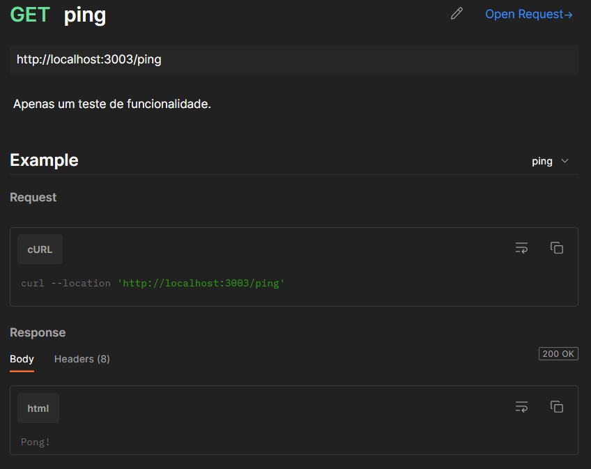

### GET AllUsers ###

Utilizado para encontrar um usuário específico na API. Deve-se sempre utilizar o nome do usuário.

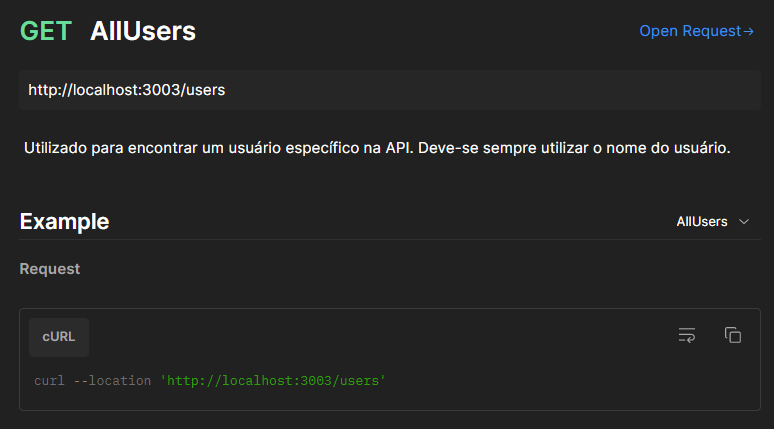
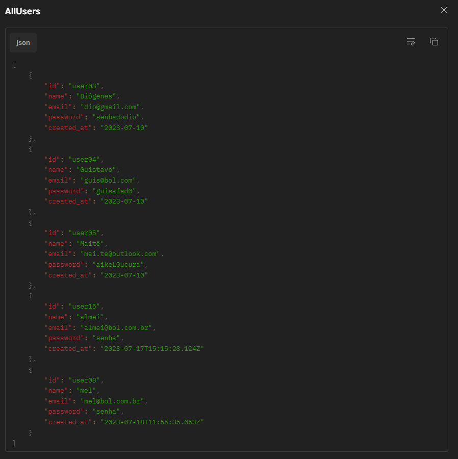

### GET AllProducts ###

Utilizado para encontrar um produto específico na API. Deve-se sempre utilizar o NOME do produto.

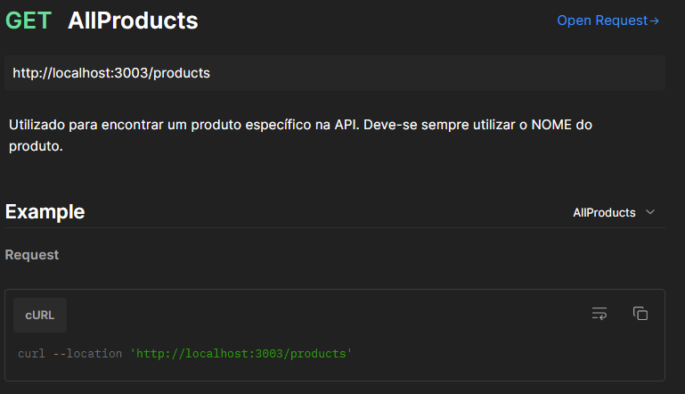
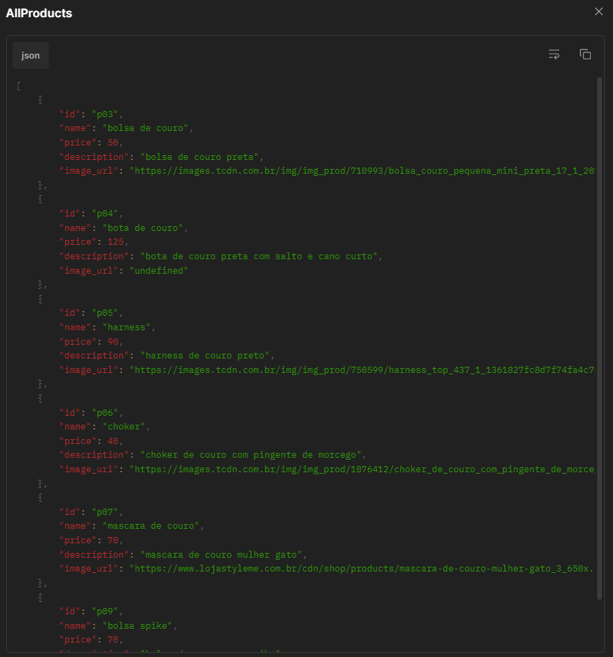

### GET AllPurchases ###

Utilizado para encontrar uma compra específico na API. Deve-se sempre utilizar o NOME da compra.

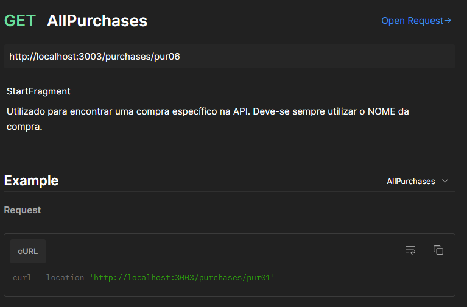
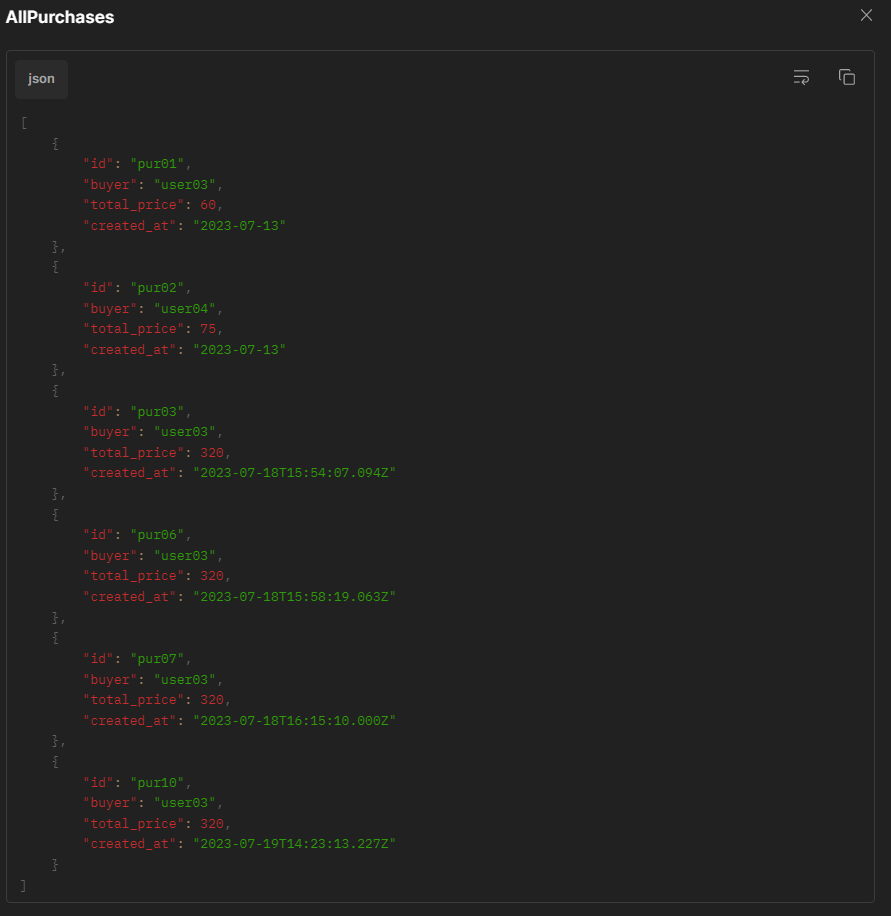

### POST CreateUser ###

Utilizado para criar um novo usuário na API. É necessário preencher todos os dados:
ID;
NOME (name);
EMAIL;
SENHA (password).

Observações:
o ID não pode ser igual a um ID existente;
o EMAIL não pode ser cadastrado mais de uma vez;
todos os dados devem ser do tipo string.

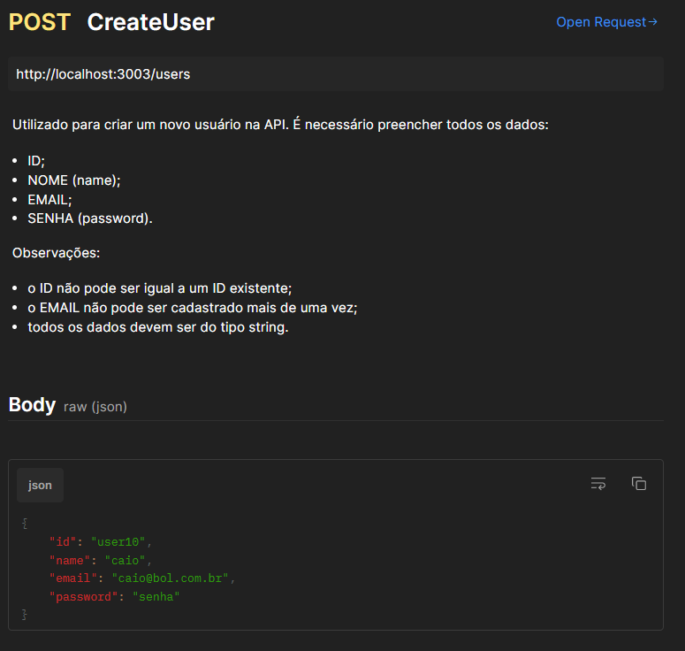
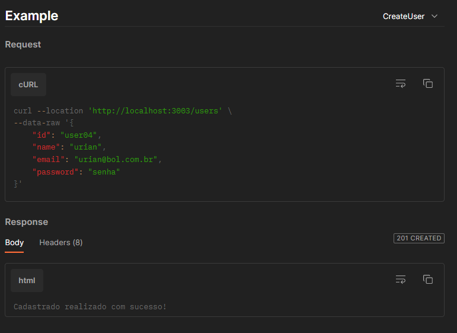

### POST CreateProduct ###

Utilizado para criar um novo produto na API. É necessário preencher todos os dados:
ID;
NOME (name);
PREÇO (price);
DESCRIÇÃO (description);
IMAGEM (imageUrl).

Observações:
ID, NOME, DESCRIÇÃO e IMAGEM, devem ser do tipo string.
PREÇO deve ser do tipo number.
o ID não pode ser igual a um existente no sistema.
o PREÇO não pode ser zerado.

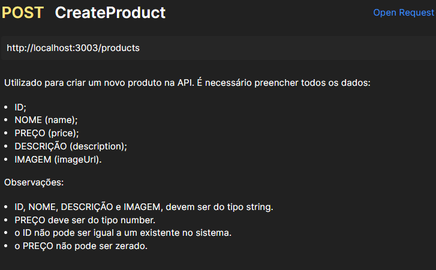
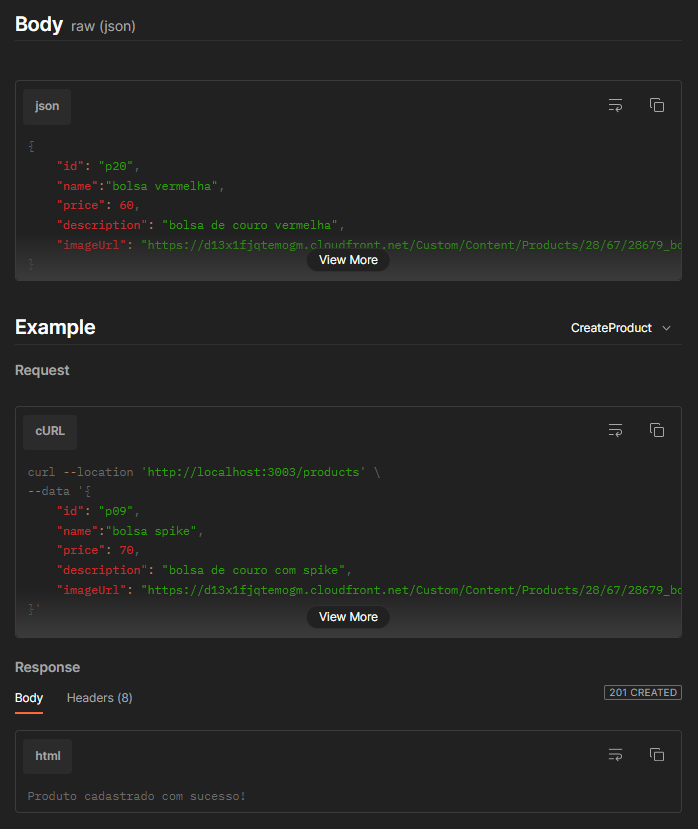

### POST CreatePurchase ###

Utilizado para criar uma nova compra. É necessário preencher todos os dados:
ID da compra;
Buyer (ID do comprador);
ID dos produtos;
Quantidade dos produtos.

Observações:
ID da compra, Buyer, e ID dos produtos devem ser Strings;
Quantidade de produtos deve ser número.

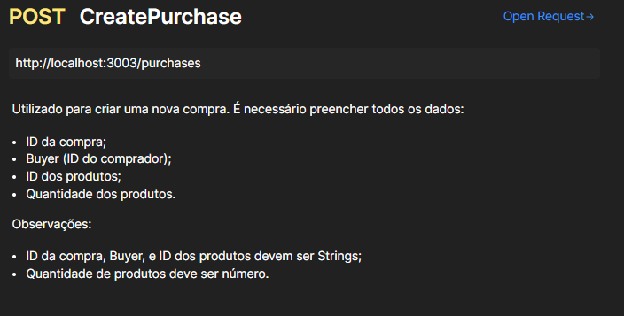
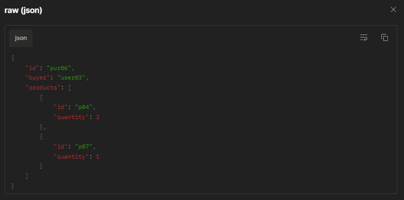
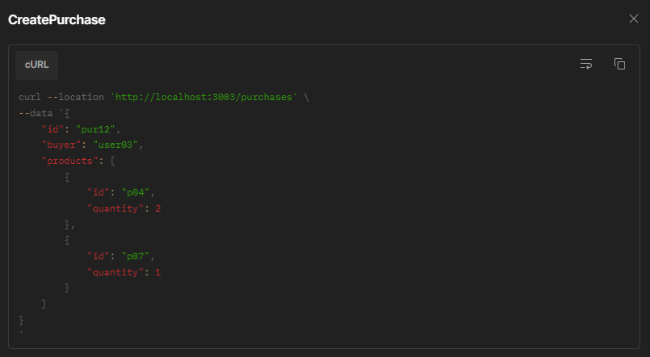
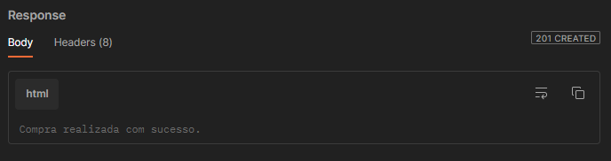

### PUT EditProduct ###

Utilizado para editar um produto específico da API. Deve-se sempre utilizar o ID do produto.
Não é necessário preencher todos os dados.
Observações:
ID, NOME, DESCRIÇÃO e IMAGEM, devem ser do tipo string.
PREÇO deve ser do tipo number.
o ID não pode ser igual a um existente no sistema.
o PREÇO não pode ser zerado.

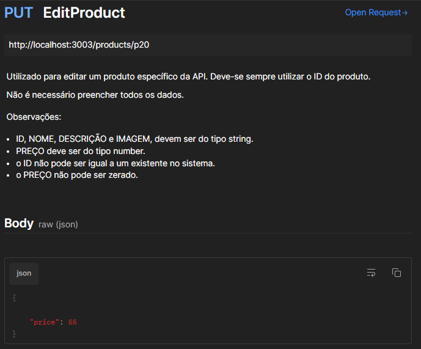
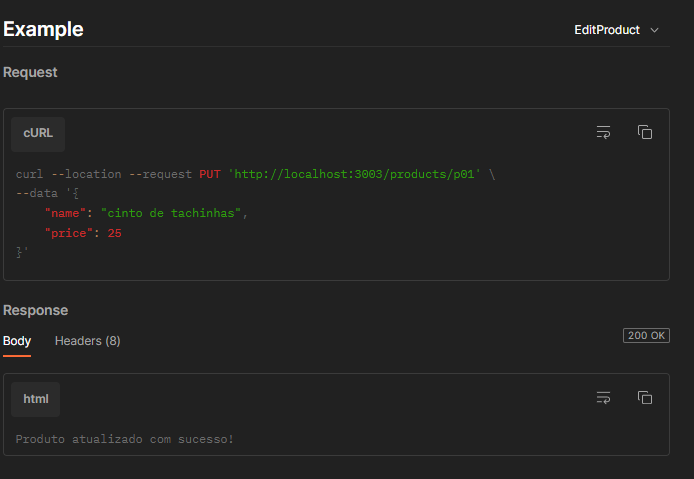

### DEL DeleteUser ###

Utilizado para apagar um usuário específico da API. Deve-se sempre utilizar o ID do usuário.
EndFragment

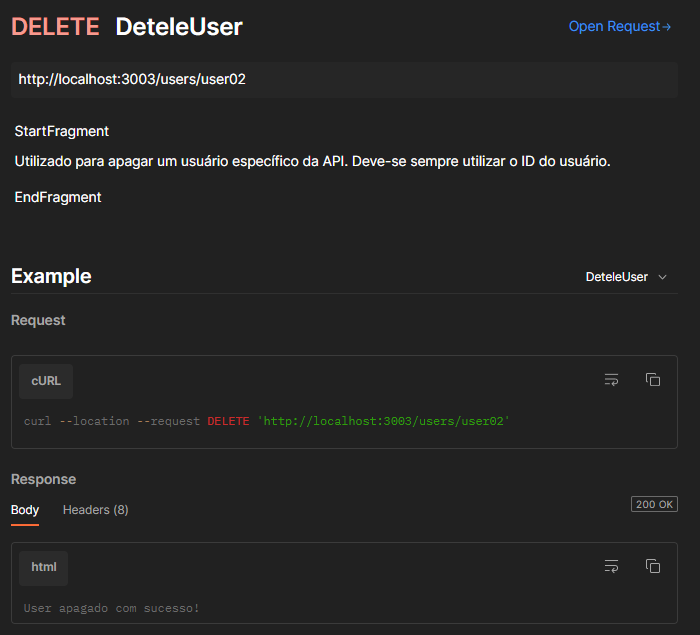

### DEL DeleteProduct ###

Utilizado para apagar um produto específico da API. Deve-se sempre utilizar o ID do produto.

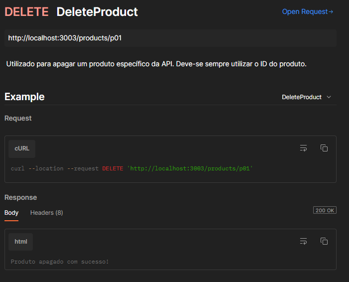

### DEL DeletePurchase ###

Utilizado para apagar uma compra específica da API. Deve-se sempre usar o ID da compra.

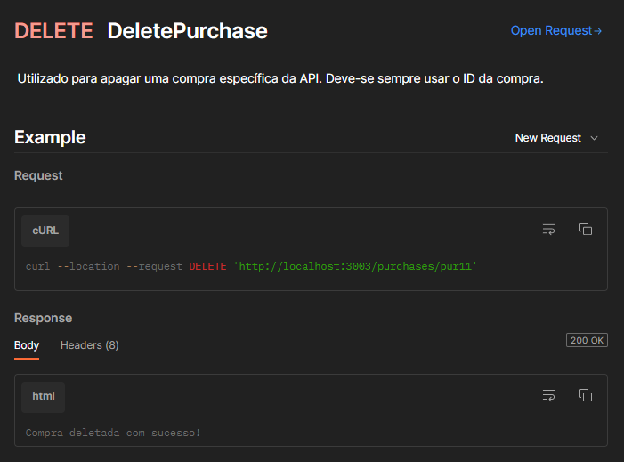
